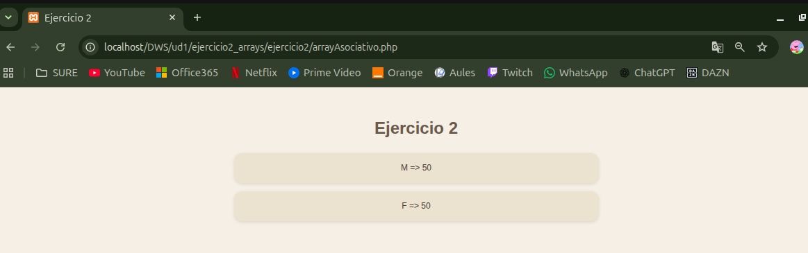

# UNIDAD 1 - EJERCICIO 2 - ARRAYS

## Enunciado

Rellena un array de 100 elementos de manera aleatoria con valores M o F (por ejemplo [“M”, “M”, “F”,
“M”, …]). Una vez completado, vuelve a recorrerlo y calcula cuantos elementos hay de cada uno de los valores almacenando el resultado en un array asociativo [‘M’ => 44, ‘F’ => 66] (no utilices variables
para contar las M o las F). Finalmente, muestra el resultado por pantalla

## Comprobación

