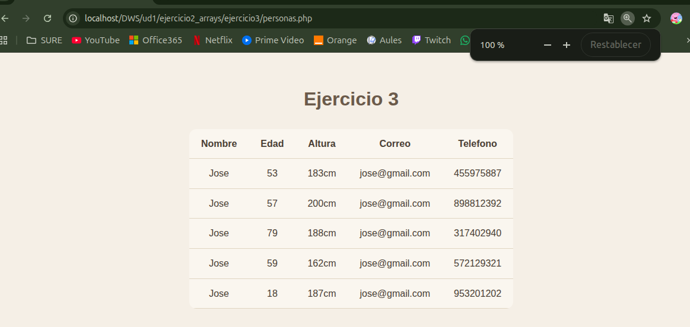

# UNIDAD 1 - EJERCICIO 3 - ARRAYS

## Enunciado

Mediante un array bidimensional, almacena el nombre, altura y email de 5 personas. Para ello, crea
un array de personas, siendo cada persona un array asociativo: [ [‘nombre’=>‘Aitor’, ‘altura’=>182,
‘email’=>‘aitor@correo.com’],[…],… ] Posteriormente, recorre el array y muéstralo en una tabla
HTML.

## Comprobación

