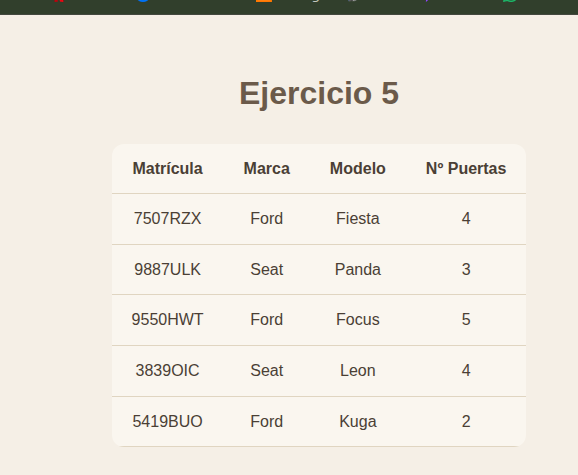

# UNIDAD 1 - EJERCICIO 4 - ARRAYS

## Enunciado

Crea una página llamada coches.php. Define dentro un array bidimensional mixto donde:
La primera dimensión sea asociativa. Aquí pondremos matrículas de coches. La segunda dimensión
será numérica. En cada casilla guardaremos la marca, modelo y número de puertas del coche en
cuestión. Por ejemplo, el coche con matrícula “111BCD” puede ser un “Ford” (casilla 0), modelo “Focus” (casilla 1) de 5 puertas (casilla 2). Rellena el array con al menos 3 o 4 coches, y después utiliza las
estructuras adecuadas para recorrerlo mostrando los datos de los coches ordenados por matrícula.

## Comprobación

