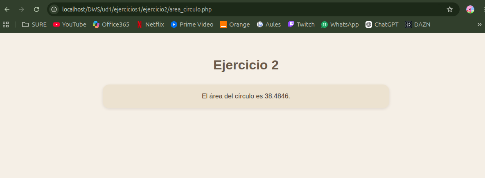

# UNIDAD 1 - EJERCICIO 2

## Enunciado

Crea una página en la carpeta de ejercicios llamada area_circulo.php. En
ella, crea una variable $radio y ponle el valor 3.5. Según esa variable, calcula en otra
variable el área del círculo (PI * 𝑟𝑎𝑑𝑖𝑜2
), deberás definir la constante PI, y muestra por
pantalla el texto “El área del círculo es XX.XX”, donde XX.XX será el resultado de calcular el área.

## Comprobación

