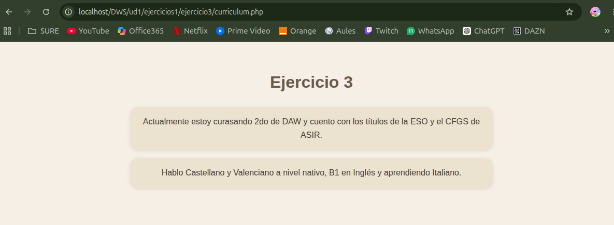

# UNIDAD 1 - EJERCICIO 3

## Enunciado

Crea una página en la carpeta de ejercicios llamada curriculum.php donde, utilizando
variables variables, muestres parte de tu currículum (por ejemplo, un párrafo con tus
estudios y otro con los idiomas que hablas), tanto en español,valencià como en otro
idioma que elijas.

## Comprobación

