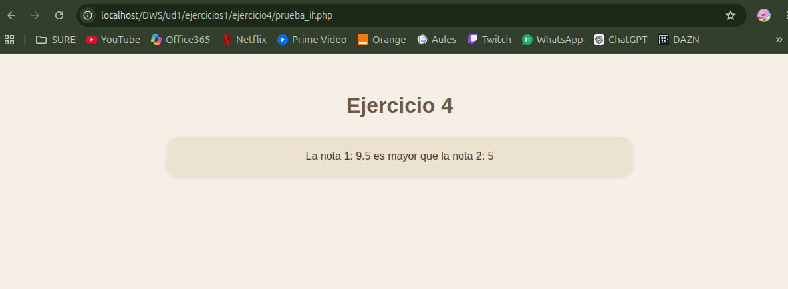

# UNIDAD 1 - EJERCICIO 4

## Enunciado

Crea una página llamada prueba_if.php en la carpeta de ejercicios del tema. Crea en
ella dos variables llamadas $nota1 y $nota2, y dales el valor de dos notas de examen
cualesquiera (con decimales si quieres). Después, utiliza expresiones if..else para determinar qué nota es la mayor de las dos.

## Comprobación

