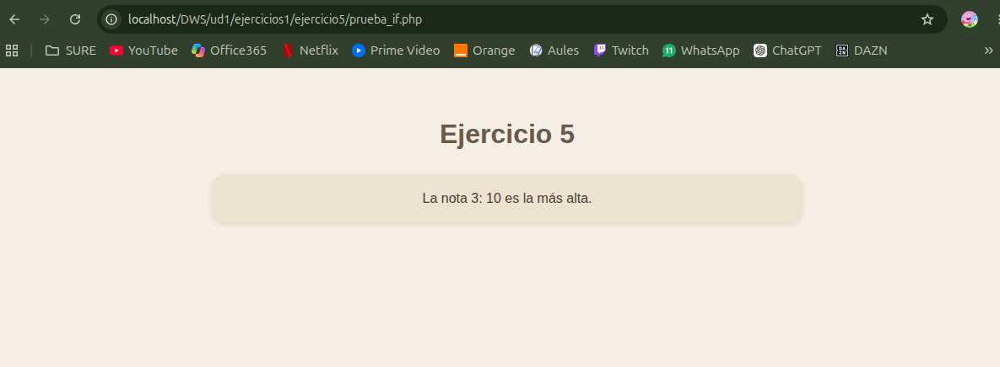

# UNIDAD 1 - EJERCICIO 5

## Enunciado

Modifica el ejercicio anterior añadiendo una tercera nota $nota3 , y determinando cuál
de las 3 notas es ahora la mayor. Para ello, deberás ayudarte esta vez de la estructura
if..elseif..else.

## Comprobación

