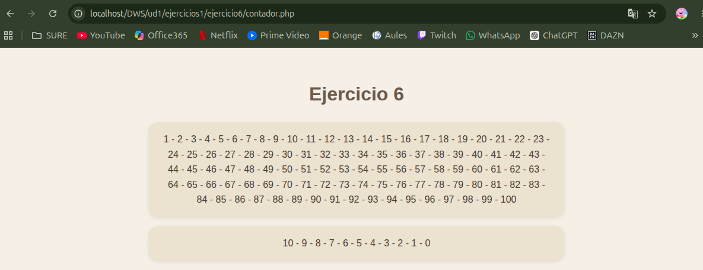

# UNIDAD 1 - EJERCICIO 6

## Enunciado

Crea una página llamada contador.php en la carpeta de ejercicios del tema. Utiliza una
estructura for para contar los números del 1 al 100 (separados por comas), y luego una
estructura while para contar los números del 10 al 0 (una cuenta atrás, separada por
guiones).
Al final debe quedarte algo como esto:
1,2,3,4,5,6,7,8,9,10,11,12,13,14,15…
10-9-8-7-6-5-4-3-2-1-0

## Comprobación

