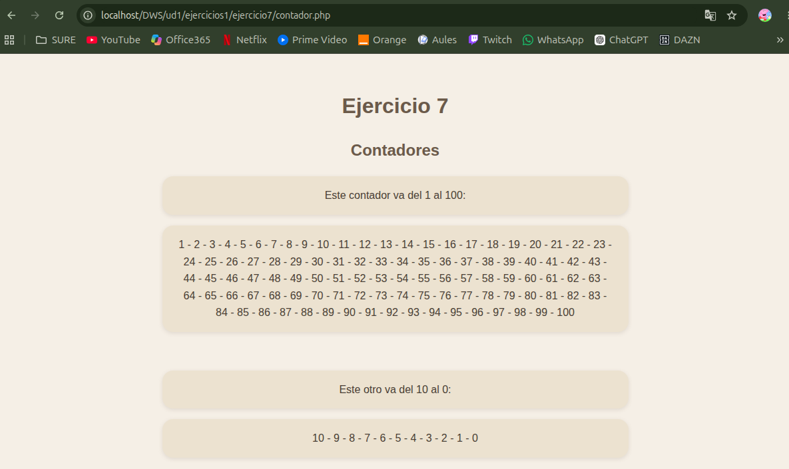

# UNIDAD 1 - EJERCICIO 7

## Enunciado

Modifica el ejercicio anterior y añádele algún h1 y párrafos explicativos a la página, fuera
del código PHP, explicando lo que se va a hacer. Por ejemplo, que te quede algo así: Al
final debe quedarte algo como esto:
Contadores
Este contador va del 1 al 100:
1,2,3,4,5,6,7,8,9,10,11,12,13,14,15…
Este otro va del 10 al 0:
10-9-8-7-6-5-4-3-2-1-0

## Comprobación

