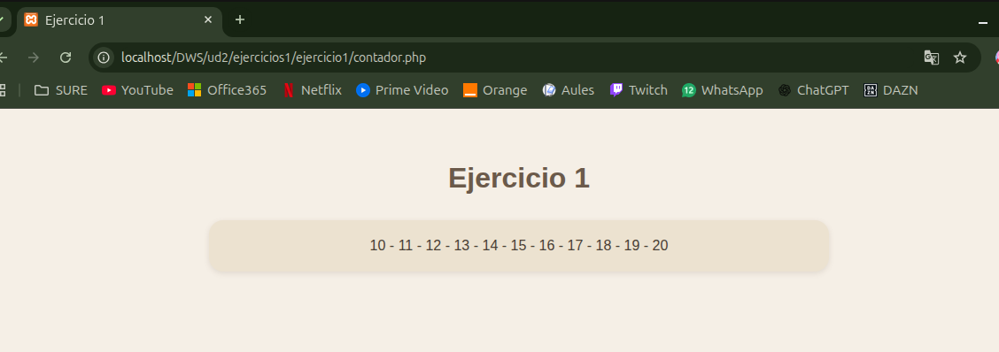

# UNIDAD 2 - EJERCICIO 1

## Enunciado
Crea una página llamada contador.php. Crea una función llamada cuenta($a, $b
) que reciba dos parámetros y vaya contando de un número al otro, separando los
números por comas. Después, pruébala en el código PHP haciendo que cuente del 10
al 20.

## Comprobación

