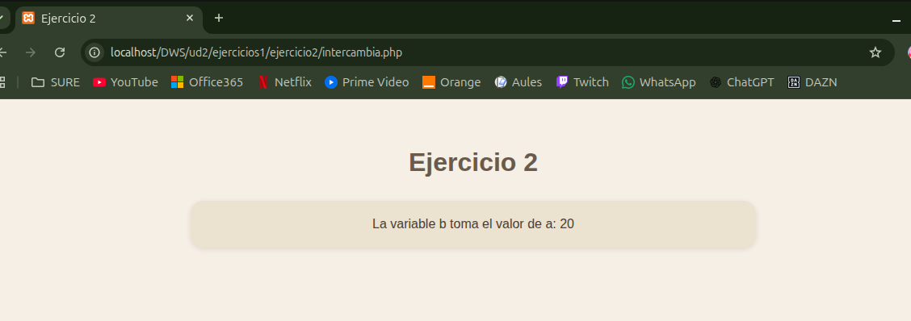

# UNIDAD 2 - EJERCICIO 2

## Enunciado
Crea una página llamada intercambia.php. Añade dentro una función llamada intercambia que reciba 2 parámetros numéricos por referencia, y lo que haga sea intercambiar sus valores. Es decir, si recibe el parámetro $a y el valor de $b , y $b tome el valor
de $a.

## Comprobación

