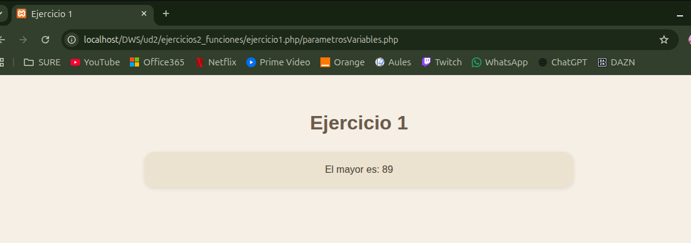

# UNIDAD 2 - EJERCICIO 1 - FUNCIONES

## Enunciado
Crea las siguientes funciones:
Una función que devuelva el mayor de todos los números recibidos como parámetro variables:
function mayor(): int. Utiliza las funciones func_get_args(), etc…
No puedes usar la función max().

## Comprobación

