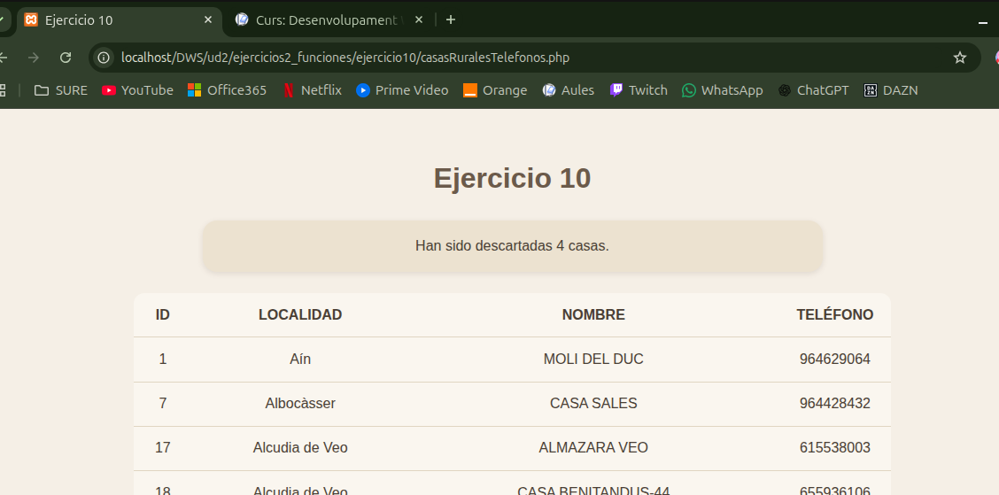

# UNIDAD 2 - EJERCICIO 10 - FUNCIONES

## Enunciado
Crea un programa llamado CasasRuralesTelefonos.php que cargue los datos de este
archivo CSV de casas rurales de la provincia de Castellón.
Queremos quedarnos con el id, localidad, nombre y telefono de las casas rurales que tengan un
teléfono definido, descartando el resto.
El programa debe mostrar por pantalla el listado final procesado, y cuántas casas rurales se
han descartado por tener datos nulos.
## Comprobación

