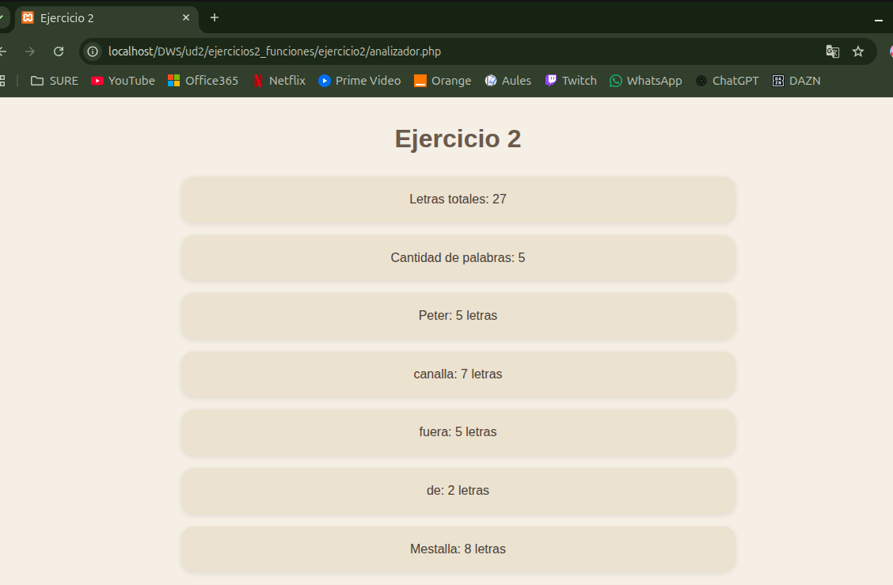

# UNIDAD 2 - EJERCICIO 2 - FUNCIONES

## Enunciado
A partir de una frase con palabras sólo separadas por espacios, devolver:
• Letras totales y cantidad de palabras
• Una línea por cada palabra indicando su tamaño
Nota: no se puede usar str_word_count

## Comprobación

