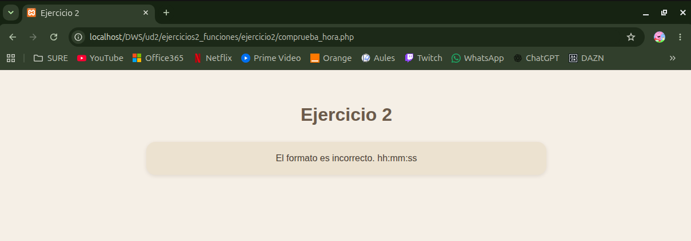

# UNIDAD 2 - EJERCICIO 2 - FUNCIONES

## Enunciado
Crea una variable de texto con una hora en ella (por ejemplo, “21:30:12”), y luego procésala
para extraer por separado la hora, el minuto y el segundo, y comprobar si es una hora válida.
Por ejemplo, la hora anterior sí debería ser válida, pero si ponemos “12:63:11” no debería serlo,
porque 63 no es un minuto válido.

## Comprobación

